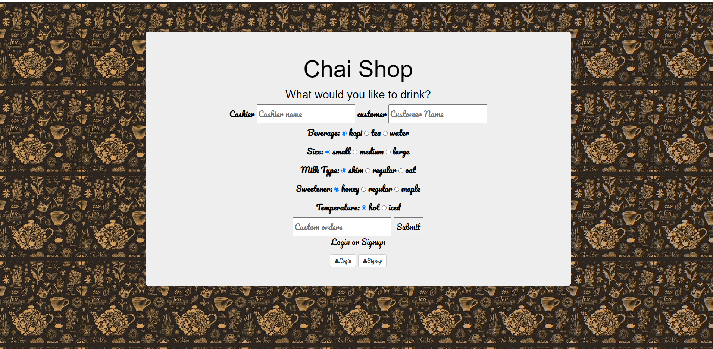

# chai-shop

## What the app is about
A full stack app that allows a cashierpunch in an order and it stores the information in the database.
The Barista is able to check off the orders according and if desired, they can delete completed orders.

## Tech used: EJS NodeJS & MongoDB

